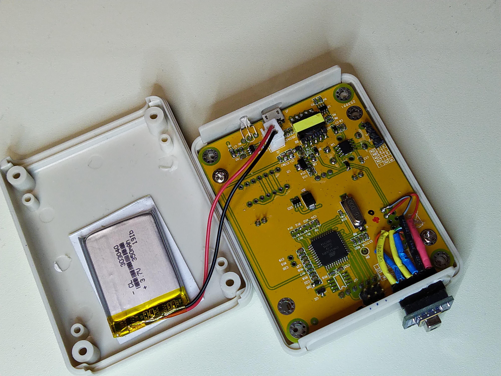

TC7-Thermal-Camera
==================

So I had this nice and cheap transistor-multi-component-tester (TC7 or TC1) and tested a charged capacitor.
There is even a red warning text on the front panel that you should discharge before testing.
As the result the processor ATMEGA324pa fried. It was not completely gone as the display was still working.

So I decided to convert it to a thermal camera.

 * Solder ICSP header and use an AVR programmer.
 * Install MightyCore boards to Arduino
   * Board ATMEGA324
   * Clock external 16MHz
   * Variant 324pa
   * Pintout: standard
 * Add connector for AMG8831
   * SCL PB1
   * SDA PB0
   * GND
   * VCC +5V
   * You can find the pins from extra header placeholder
 * Reprogram STC15L104W, with a suitable firmware, if needed. That's another story.

Find schematics from https://www.eevblog.com/forum/testgear/lcr-t7-tester-no-longer-switching-on/

This is a very rude hack, without any polishing.

